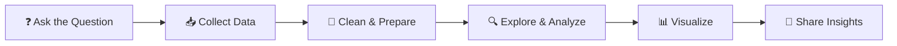

<!-- Replace every [PLACEHOLDER] with your own details. Rename the repo to match your GitHub username. -->

<div align="center">


<a href="https://git.io/typing-svg">
  
</a>

<br/>


</div>

---

## 👋 About Me

```python
class DataAnalyst:
    def __init__(self):
        self.name      = "[YOUR NAME]"
        self.location  = "[YOUR CITY, COUNTRY]"
        self.education = "[YOUR DEGREE / COLLEGE]"
        self.focus     = ["Data Cleaning", "EDA", "Visualization", "Storytelling"]
        self.learning  = ["[CURRENT TOPIC, e.g. Power BI]", "Statistics", "Machine Learning basics"]
        self.goal      = "Land a Data Analyst role and turn raw data into real impact"

    def say_hi(self):
        print("Curious mind. Coffee powered. Always asking 'why does the data say that?'")

me = DataAnalyst()
me.say_hi()
```

---

## 🛠️ Skills & Tools

**Languages & Querying**


**Analysis & Libraries**


**Visualization & BI**


**Tools**


---

## 📈 My Analysis Workflow



---

## 📊 GitHub Stats

<div align="center">


</div>

---

## 🎯 Currently

- 🔭 Working on: **[CURRENT PROJECT]**
- 🌱 Learning: **[SKILL / TOOL]**
- 📜 Certifications: **[e.g. Google Data Analytics, Power BI Data Analyst]**
- 💬 Ask me about: **Data cleaning, SQL queries, EDA, dashboards**
- ⚡ Fun fact: **[SOMETHING ABOUT YOU]**

---

## 🤝 Let's Connect

<div align="center">

[](https://linkedin.com/in/[YOUR-LINKEDIN])
[](mailto:[YOUR-EMAIL])
[](https://[YOUR-PORTFOLIO])
[](https://kaggle.com/[YOUR-KAGGLE])

<br/>

*"Without data, you're just another person with an opinion." — W. Edwards Deming*


</div>
